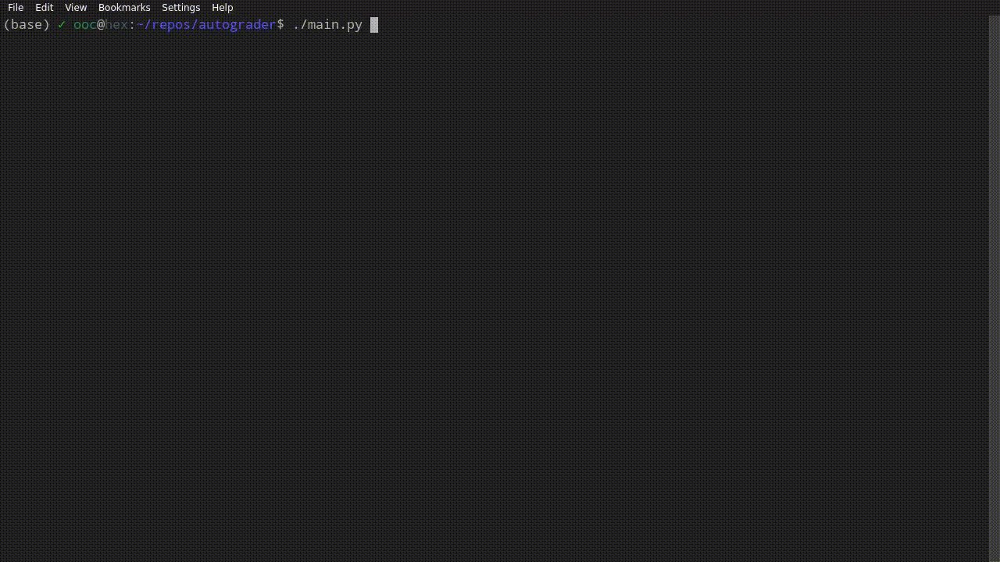

# autograder
Automatic grading using coding and algorithms.

## How It Works

Grading is done by gathering the output of a large-ish number of test cases from both the student and the grader program.
There's no limit to the number of test cases that can be used, but it seems like a reasonable number to start at is around 5 or 6.
Once the outputs from a program are collected, they are broken into individual tokens and the tokens are then compared. Tokens 
that show significant differences between the test cases are marked as being important to the grade, and tokens that remain
the same are discarded. This allows the autograder to ignore any potential whitespace, wording, or spelling differences between
the project description and the student program without the need to construct huge rigorous regular expressions for each test case.

## Usage

### Installation 

Currently working on getting a PyPI package setup. When it's done, you will be able to install the autograder using `pip install wsu-autograder`

### CLI Options

- `-c`, `--config`: Path to a json containing the grading parameters and test cases
- `-s`, `--student-directory`: Path to a student directory. Instead of grading all student submissions, only grade the one specified
- `-n`, `--no-cat`: Boolean flag. If present, the student code isn't displayed and all test cases are run automatically

Standard usage is `autograder -c path/to/config.json`

### JSON Structure

The Json is divided into two main parts, `settings` and `tests`:

- `settings`: Generic settings to be used while compiling, running, and grading the programs
  - `penalties`: Penalties to be applied when various errors are detected
    - `character_penalty`: (float, default 50) Penalty applied for every character difference between student and grader word tokens.
    - `compile_failure_penalty`: (float, default 1000) Penalty applied once if the student program fails to compile (not implemented).
    - `missing_string_penalty`: (float, default 100) Penalty applied for every required string that wasn't found in the stdout or stderr of the student program.
    - `numeric_penalty`: (float, default 10) Penalty applied whenever there is a difference between student and grader numeric token. 
    - `run_failure_penalty`: (float, default 100) Penalty applied once if the student program has a non-zero exit code.
      Penalty is scaled by the approximate percent difference between the tokens.
    - `timeout_penalty`: (float, default 100) Penalty applied once if the student program exceeded a runtime limit set for the test case.
    - `token_count_penalty`: (float, default 50) Penalty applied once if there is a mismatch between the number of student and grader tokens.
    - `type_penalty`: (float, default 20) Penalty applied whenever there is a type mismatch between student and grader tokens.
  - `all_tokens_strings`: (bool, default false) Forces all tokens to be treated as wither words or whitespace. Very useful for dealing with text processing programs
    that might output numbers as a result of the input, but you don't want the numbers to be graded differently.
  - `collapse_whitespace`: (bool, default true) Whether or not the amount of whitespace between characters should be considered important for this program.
  - `connect_adjacent_words`: (bool, default false) When set to true, adjacent word tokens that have all been marked as important will be combined into one large token.
    Very useful for programs that primarily deal with text processing.
  - `enforce_floating_point`: (bool, default false) If the grader has a decimal point in the output, the student must too and vice versa. If false, `10.0` and `10` will
    be considered to be equal.
  - `grader_directory`: (path, default 'Grader') The relative path from the config json to the directory containing all of the grader code.
  - `ignore_nonumeric_tokens`: (bool, default false) The opposite of `all_tokens_strings`. Discards any tokens that aren't either ints or floats when grading.
  - `language`: (string, default 'java') The language that the program being graded is written in. Current valid options are `'bash'`, `'c'`, `'cpp'`, `'c++'`,
    `'java'`, `'python'`, `'sh'`, and `'shell'`.
  - `pass_threshold`: (float, default 95) The grade out of 100 considered to be a passing grade for the tests. Mostly only effects the formatting of output.
  - `penalty_weight`: (float, default 0.1) A constant used to set how much the accumulated penalties will effect the student's score. Score is computed
    using the equation `100 * exp(penalty * weight)`.
  - `student_directory`: (path, default 'Student') The relative path from the config json to the directory containing all of the student directories.
- `test`: an array of dictionaries with the following structure:
  - `args`: (array(string), default []) An array of strings to be passed as command line arguments to the student program when running this test case.
  - `command` (array(string), default None) Specifies a custom command to be used to run this test case. Should only be used in very certain cases, since the
    `args` and `runner_args` flags should usually work in most any situation.
  - `description`: (string, default '') A human readable description of the test case.
  - `required_strings`: (array(string), default []) A list of strings that are required to be present in the stdout of the program. For each of the strings that are missing
    the `missing_string_penalty` will be applied.
  - `required_strings_stderr`: (array(string), default []) A list of strings that are required to be present in the stderr of the program. For each of the strings that are 
    missing, the `missing_string_penalty` will be applied.
  - `runner_args`: (array(string), default []) A list of strings to be prepended to the command used to run the test case. Useful for testing with valgrind or running
    student code inside of a container.
  - `stdin`: (string, default '') The data to be piped into stdin of the program while running the test case.
  - `timeout`: (float, default 5) The number of seconds to wait before terminating the program being graded and marking it as having timed out on the test case.
  - `weight`: (float, default 1) The weight to be applied to the test case's grade when computing the overall grade.

## Limitations

There are currently a few limitations to what the autograder can handle. There are workarounds that allow some these cases to
be handled properly, but they are less than ideal and full support will need to be added to the autograder in the future.

### Floats starting with `.`

If a floating point number in the output is in the form `.###` or `-.###`, it will currently be split into two individual tokens.
The first token will be a word containing `.` or `-.` and the second token will be an integer equal to `###`. If a student program
uses this format and the grader program doesn't a numeric mismatch between `0.###` and `###` will be detected and the student marked
as incorrect. There is currently no workaround for this issue.

### Out of order tokens

The autograder will discard any unimportant tokens, but the important tokens found must be in the exact same order in the student
program and the grader program, otherwise the student will be graded incorrectly. For example, if the grader prints the size of a box
as `length x height` and the student prints the size of the box as `height x length`, the student will be marked incorrect even if
the values printed out were correct. There is currently no workaround for this issue.

### Random number generators

The output of a program must be deterministically determined by its inputs and command line arguments, within a very small margin of
error to allow for IEEE-754 uncertainties. As such, if a programs output is partially or completely determined by a random number
generator, the autograder will not be able to detect and compare the tokens correctly. A workaround for this issue is to either have
the student take their RNG seed from an argument or stdin, or to simply have their code use a constant seed while grading.

### Programs looping over varying length input

If the program executes and prints results from the same block of code depending on the length of the user input, extra tokens can
be incorrectly detected as being important. For example, if the assignment being graded is to make a simple shell and the shell prompt
is printed for every line in user input it can be flagged as an important token even though it's not required to have any particular value.
A potential workaround for this is to make sure all the supplied test cases will loop over the same number of iterations.

### Programs with constant output

If a program's output is fixed and doesn't change based on stdin or arguments, there will be no test cases for the autograder to compare
and the important tokens will not be detected.

## Notes

### Required libraries

There are several python libraries required to run the autograder. They are:

- **binaryornot** (Used to check if a file is binary): `conda install binaryornot` or `pip install binaryornot`
- **lark** (Used to parse student output): `conda install -c conda-forge lark-parser` or `pip install lark-parser`
- **pygments** (Used for syntax highlighting): `conda install pygments` or `pip install Pygments`
- **tqdm** (Used for progress bars): `conda install tqdm` or `pip install tqdm`

An exported yaml of the conda environment used to develop the autograder can be found in the `environment.yml` file in this repository.

### TODOs

- An extra tool that will automatically extract and grade a pilot bulk download
- A web interface for grading. Upload config, Grader, and Student zip and go
- Add a similar field to the `required_strings` that can be used to specify a list of regexes that need to match the student output
- Add another thing kinda like `required_strings`, only that all it does is that it automatically flags any matching text as a token
- The ability to capture and display the stdin and stdout of the program alongside each other. The stdout will need to be unbuffered to do this. Look at pty?
- A prompt to display the student's code after inspecting incorrect results?